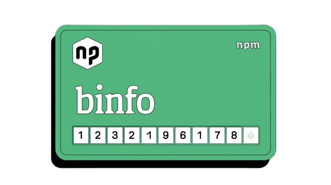

<br/>
<p align="center">

</p>
<h4 align="center">A high-performance npm package that provides card BIN (Bank Identification Number) information quickly and efficiently with SQL.</h6>
<p align="center">

 

 
 

<a href="https://discord.gg/luppux" target="_blank"> 
 
</a>
<a href="https://www.buymeacoffee.com/beykant" target="_blank">

</a>
</p>


## Installation

Using npm:
```shell
$ npm install binfo
```

Other Installations:

```bash
$ yarn add binfo
```

```bash
$ pnpm add binfo
```

## Usage
```js
import bin, { CardBrand, CardType, CardLevel } from 'binfo';
/* For CommonJS */
/* const bin = require('binfo'); */

async function binCheck() {


    /* Find Bin - Promise<BinResponse> */


   var findBin = await bin.findBin({ bin: '999960' });
   console.log(findBin); 
   /* Output:
   {
  bin: '999960',
  card: { brand: 'LOCAL BRAND', type: 'DEBIT', level: 'PREPAID' },
  bank: { name: 'BC CARD', website: '', phone: '+8215884000' },
  country: {
    name: 'KOREA, REPUBLIC OF',
    code: 'KR',
    iso3: 'KOR',
    emoji: '🇰🇷'
  },
  currency: 'KRW'
}
   */


   /* Search Bin List - Promise<BinResponse[]> */


    var findBins = await bin.findBins({ currency: 'USD' },{ $limit: 5 });
    console.log(findBins);
    /* Output:
    [{
    bin: '223009',
    card: { brand: 'MASTERCARD', type: 'DEBIT', level: 'ENHANCED' },
    bank: {
      name: 'COMPUTER SERVICES, INC.',
      website: '',
      phone: '+18005454274'
    },
    country: { name: 'UNITED STATES', code: 'US', iso3: 'USA', emoji: '🇺🇸' },
    currency: 'USD'
  },
  {
    bin: '223013',
    card: { brand: 'MASTERCARD', type: 'DEBIT', level: 'ENHANCED' },
    bank: {
      name: 'COMPUTER SERVICES, INC.',
      website: '',
      phone: '+18005454274'
    },
    country: { name: 'UNITED STATES', code: 'US', iso3: 'USA', emoji: '🇺🇸' },
    currency: 'USD'
  },
  {
    bin: '223019',
    card: { brand: 'MASTERCARD', type: 'DEBIT', level: 'BUSINESS' },
    bank: {
      name: 'COMPUTER SERVICES, INC.',
      website: '',
      phone: '+18005454274'
    },
    country: { name: 'UNITED STATES', code: 'US', iso3: 'USA', emoji: '🇺🇸' },
    currency: 'USD'
  },
  {
    bin: '223020',
    card: { brand: 'MASTERCARD', type: 'CREDIT', level: 'STANDARD' },
    bank: { name: 'CAJA CENTRAL FINANCOOP', website: '', phone: '' },
    country: { name: 'ECUADOR', code: 'EC', iso3: 'ECU', emoji: '🇪🇨' },
    currency: 'USD'
  },
  {
    bin: '223021',
    card: { brand: 'MASTERCARD', type: 'CREDIT', level: 'STANDARD' },
    bank: { name: 'CAJA CENTRAL FINANCOOP', website: '', phone: '' },
    country: { name: 'ECUADOR', code: 'EC', iso3: 'ECU', emoji: '🇪🇨' },
    currency: 'USD'
  }]
    */


    /* Create Bin - Promise<boolean> */


    var createBin = await bin.createBin({ bin: '999999', cardBrand: 'LOCAL', cardType: 'TEST', cardLevel: 'TEST', bankName: 'Bes-js', bankWebsite: 'https://github.com/Bes-js', bankPhone: '+123456789', countryName: 'Türkiye', countryCode: 'BES', countryIso3: 'BES-JS', currency: 'TRY' });
    console.log(createBin);
    /* Output:
    true
    */


    /* Update Bin - Promise<boolean> */


    var updateBin = await bin.updateBin({ bin: '999999' }, { bin: '123456', cardBrand: 'TEST' });
    console.log(updateBin);
    /* Output:
    true
    */


    /* Delete Bin - Promise<boolean> */


    var deleteBin = await bin.deleteBin({ bin: '123456' });
    console.log(deleteBin);
    /* Output:
    true
    */


};

binCheck();
```

## License

binfo is licensed under the **MIT** License. See the [LICENSE](./LICENSE.md) file for details.

## Support

[](https://discord.gg/luppux)
